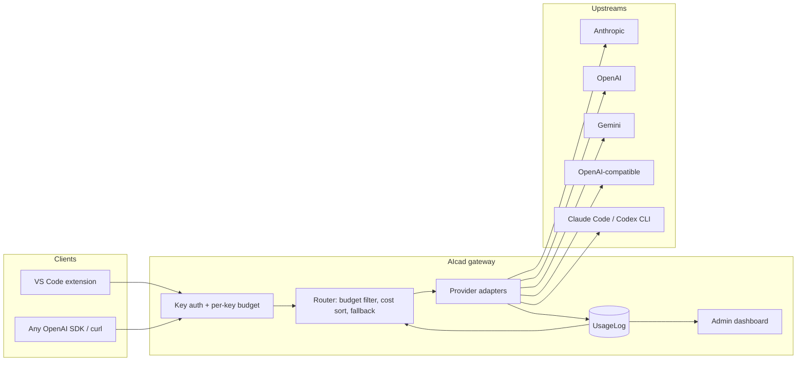
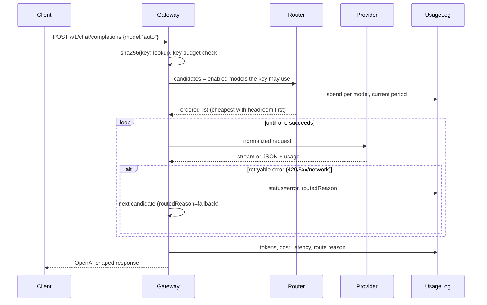

# AIcad: a self-hosted AI gateway and VS Code agent

Technical write-up for the "strongest production AI workflow" submission.

- Gateway: https://github.com/arsyad7/ai-gateway
- VS Code extension: https://github.com/arsyad7/ai-gateway-vscode

<!-- TODO(arsyad): sections marked TODO need your own words. Everything else is
     drawn from the code and the production usage database on 2026-09-29. -->

## 1. What I built and what I personally owned

AIcad is a single OpenAI-compatible endpoint in front of several AI providers,
plus a VS Code extension that uses it for chat and for an approval-gated
coding agent. I designed, built and operate every part of it:

| Component | Size | What it does |
|---|---|---|
| Gateway (Next.js 15, Prisma, SQLite) | ~7,000 lines TS | `/api/v1/chat/completions` and `/api/v1/models` with the OpenAI wire format, budget-aware routing, per-key limits, usage logging, admin dashboard |
| Provider adapters | 6 | Anthropic, OpenAI, Google Gemini, any OpenAI-compatible server, and two CLI adapters (Claude Code, Codex) that bill to a subscription instead of an API key |
| Agent loop | `/api/v1/agent` | Server-side ReAct loop with native tool calling, budget re-checked before every iteration, model switch mid-run when a budget runs out |
| VS Code extension | ~2,700 lines TS/JS | Chat panel with streaming Markdown, model and server pickers, right-click code actions, and an agent mode that asks before every file edit or command |
| Operations | `scripts/` | Health endpoint, watchdog, scheduled-task installer (see section 5) |

<!-- TODO(arsyad): one paragraph on why you built it. What problem were you
     hitting that made a gateway worth writing instead of calling providers
     directly? -->

## 2. Architecture

One request, end to end:

Key decisions:

- **Budgets are the routing signal.** Every model carries an optional token or
  USD limit per day, week or month. Exhausted models are removed from `auto`
  routing; an explicit request to one returns `429 model_budget_exhausted`.
  Budget is read from the usage log at request time, so there is one source of
  truth and no counter to drift.
- **Fallback is logged, not hidden.** Each usage row records whether it was
  served `explicit`, `auto`, `fallback` or `agent`, so the dashboard can show
  how often routing actually saved a request.
- **Provider keys never leave the server.** They are stored AES-256-GCM
  encrypted; clients only ever hold gateway keys, which are stored as SHA-256
  hashes and shown once.
- **Cost is computed from real usage frames**, including cache-read and
  cache-write tokens at their provider rates, not estimated from characters.

## 3. How it ran in production

The gateway runs on my workstation behind a Cloudflare tunnel, and the VS Code
extension on the same and other machines talks to it through that URL. Figures
from the live database as of 2026-09-29:

| Metric | Value |
|---|---|
| Requests served | 247 (237 ok, 96%) |
| Tokens accounted | 4.03 M |
| Active days | 5 (2026-09-20 to 2026-09-25) |
| Routed by `auto` | 155 |
| Served by the agent loop | 28 |
| Gateway keys issued | 3 |
| Providers / models live | 1 / 4 (Claude Code CLI: haiku, sonnet, opus, fable) |
| Mean latency (ok requests) | 11.7 s, dominated by CLI process spawn |

Error breakdown over the same period: 3 `stream_interrupted`, 2 `cli_error`,
1 `codex_error`, 1 `invalid_model`, 1 `upstream_401`, 2 unclassified.

<!-- TODO(arsyad): what did you actually use it for day to day? Which agent
     tasks worked, which did not? One concrete example is worth more than a
     list. -->

## 4. Trade-offs I reasoned through

- **CLI adapters instead of API keys.** Routing through `claude -p` bills to a
  personal Claude subscription and needs no API key, but each call spawns a
  process (seconds of latency), tool calls become prompt-based instead of
  native, and reported prompt tokens include Claude Code's own system prompt
  and cache traffic. I kept it because for a personal gateway the cost
  profile wins, and documented that it must not be resold as a public API.
- **SQLite over Postgres.** One file, zero setup, fine for one user and a few
  hundred requests a day. The schema switches to Postgres by changing one
  line, and section 7 lists this as the first thing to change for multi-user
  use.
- **Budgets are a monthly-bill guard, not a hard gate.** A request already in
  flight when a limit is crossed still completes. A hard gate would need a
  reservation step before every call; the cost of an occasional overrun is
  one request.
- **Quick tunnel first.** Cloudflare quick tunnels need no account or domain,
  which got the extension working on other machines in minutes. The price is
  a hostname that changes on every restart; see section 5.

<!-- TODO(arsyad): add one trade-off you decided differently than I described,
     or one you would decide differently now. -->

## 5. A failure I turned into a permanent guardrail

**What happened.** On 2026-09-25 at 11:05 the last request of the day was
logged. From then on every request through the tunnel got Cloudflare error
530 ("origin unreachable"). The usage log showed nothing wrong, because the
failed requests never reached the gateway: to the dashboard the afternoon
simply looked quiet.

**Root cause.** The gateway had been started from a terminal session. When
that session's process tree was cleaned up, `node` went with it. The tunnel
process survived, so Cloudflare kept accepting traffic and forwarding it to a
port nobody was listening on. Three days later the tunnel's edge connection
also dropped; a quick tunnel cannot recover its hostname, so `cloudflared`
sat in a retry loop (5,400 attempts in the log) while the public URL no longer
resolved.

**Why the first fix was not enough.** I restarted the server "detached" with
`Start-Process`. It died the same way a day later: the wrapper was still a
child of the shell, and the shell's lifetime was the actual problem, not the
launch command.

**The guardrail.** Three pieces, all in the repository:

1. `GET /api/health`: unauthenticated probe that returns 503 when the
   database is unreachable, so a running-but-broken server counts as down.
2. `scripts/watchdog.ps1`: checks the health endpoint and restarts the gateway
   when it fails; checks that a `cloudflared` process exists for the port and
   that its log's last connection event is a successful registration, and
   restarts it otherwise; publishes the current tunnel URL to a file.
3. `scripts/install-watchdog.ps1`: registers the watchdog as a per-user
   scheduled task, every minute and at logon, with no admin rights. Processes
   started by the Task Scheduler do not belong to any terminal, which removes
   the root cause rather than papering over it.

**Verification.** With the task registered I killed the server process at
21:25:00. The watchdog detected the failed health check at 21:25:50 and the
server answered `/api/health` again at 21:25:59, with no manual action.

**What I would still add.** A named Cloudflare tunnel (stable hostname,
reconnects on its own), and an alert when the watchdog restarts something
more than once an hour, so a crash loop is noticed rather than silently
absorbed.

## 6. Measurable outcome

<!-- TODO(arsyad): pick the one or two numbers that matter to you and say why.
     Candidates from the data: 155 of 237 successful requests were routed by
     "auto" without the client choosing a model; 96% success rate across four
     models; 4 M tokens accounted with per-model budgets enforced; recovery
     from a killed server in under 60 s versus 3 days of silent downtime
     before the guardrail. -->

## 7. What is not production-ready

Being honest about what remained:

- **Single user, single machine.** SQLite, no migrations workflow, no
  multi-tenant separation beyond per-key budgets. Moving to Postgres is a one
  line schema change but has not been done.
- **Availability depends on my workstation being on and logged in.** The
  scheduled task runs in the user session; a reboot without logon leaves the
  gateway down until someone logs in.
- **The public URL is ephemeral.** A quick tunnel gets a new hostname on every
  restart. A named tunnel needs a Cloudflare zone, which this deployment does
  not have yet.
- **No automated tests.** Behaviour has been verified by hand and by
  production use, not by a test suite. The router and the cost calculation are
  the two places I would test first.
- **Observability is a dashboard, not alerts.** Nothing pages anyone when
  errors rise; the 530 incident above is exactly the failure this would have
  caught earlier.
- **Windows-only operations scripts.** The gateway is portable; the watchdog
  and installer are PowerShell.

## 8. How I used AI tools while building this

<!-- TODO(arsyad): they explicitly assess "AI-tool leverage" and "how quickly
     you learn". Say which parts you wrote, which you generated and then
     reviewed or reworked, and give one example where a generated approach was
     wrong and how you caught it. -->
